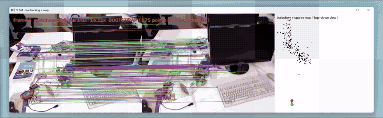

# Monocular Visual SLAM

A monocular visual SLAM system built from scratch in Python (OpenCV,
NumPy/SciPy), following the reference paper,
[ORB-SLAM (Mur-Artal et al., 2015)](https://arxiv.org/abs/1502.00956) (bootstrap, PnP tracking,
keyframe mapping, bundle adjustment, loop closure, relocalization). Then
streamlined the pipeline for a CPU-only budget and extended it with two neaural network-based components (SuperPoint, LightGlue, via ONNX Runtime), aiming to test whether learned components could improve robustness in classically hard conditions for SLAM, such as rotation-only motion or low-texture scenes.

**Highlights:**
- **Streamlining the pipeline for CPU-only execution made it ~4x faster and reduced tracking error by ~55% (ATE RMSE: 0.0702m → 0.0317m) on the `TUM RGB-D freiburg1_xyz` benchmark dataset**
- **Adding SuperPoint + LightGlue pushed accuracy further on `TUM RGB-D freiburg1_xyz`**

## Demo



Live tracking and map using the streamlined pipeline on `TUM RGB-D freiburg1_xyz`. Left: reference keyframe, with keypoints matched to the live frame. Middle: live camera view. Right: map of keypoints and trajectory, top-down view.

## Results

Scored against ground truth on the [TUM RGB-D](https://cvg.cit.tum.de/data/datasets/rgbd-dataset) benchmark with `evo`, RMSE in
meters. Absolute Trajectory Error (ATE): global drift over the whole
trajectory, and Relative Pose Error (RPE): frame-to-frame drift.

<!--
TODO(Albin): optional supporting visual: one estimated-vs-ground-truth
trajectory plot (results/*_vs_groundtruth.png from a local run; results/ is
gitignored, so copy the one you want into docs/media/ and reference it
below), placed right above or below the tables it corroborates.


-->

**`freiburg1_xyz`** (798 frames, 30.1s):

| Configuration | Coverage | ATE RMSE (m) | RPE RMSE (m) | Runtime |
|---|---|---|---|---|
| Paper-parity pipeline† | 86.5% | 0.0702 | 0.0898 | ~20 min |
| **Streamlined pipeline** | 86.6% | 0.0317 | 0.0302 | **4m48s** |
| &nbsp;&nbsp;&nbsp;&nbsp;+ SuperPoint detector | 86.6% | 0.0415 | 0.0595 | 6m51s |
| &nbsp;&nbsp;&nbsp;&nbsp;+ SuperPoint detector + LightGlue matcher | 86.6% | **0.0281** | **0.0293** | 36m00s |

† No streamlining flags: matches the reference paper's architecture (see
[Architecture](#architecture)), not its accuracy.

**`freiburg2_xyz`** (3669 frames, 122.7s):

| Configuration | Coverage | ATE RMSE (m) | RPE RMSE (m) | Runtime |
|---|---|---|---|---|
| **Streamlined pipeline** | 99.6% | 0.1015 | 0.0329 | 23m50s |
| &nbsp;&nbsp;&nbsp;&nbsp;+ SuperPoint detector | \* | \* | \* | \* |
| &nbsp;&nbsp;&nbsp;&nbsp;+ SuperPoint detector + LightGlue matcher | 99.6% | 0.1342 | **0.0313** | 157m20s |

\* Superpoint detector without learned LightGlue matcher fails tracking. Details in [EVALUATION_RESULTS.md](EVALUATION_RESULTS.md), section `#38`.

**Streamlining the pipeline:**
`--essential-only-bootstrap --single-keyframe-point-creation
--orb-single-pass` swap three paper-fidelity mechanisms for cheaper
alternatives, in keeping with this project's CPU-only constraint (see
[Tech stack](#tech-stack)). On `freiburg1_xyz`/`freiburg2_xyz` this isn't
just several times faster than the full paper-parity pipeline, surprisingly
it's also more accurate, and not fully explained.

**Adding learned components:**
Swapping in SuperPoint's learned descriptors but keeping classical matching
regresses accuracy on `freiburg1_xyz` and loses tracking entirely on
`freiburg2_xyz`. Only pairing SuperPoint with LightGlue's learned matching
turns it into a real improvement. On both sequences, the matcher, not the
detector, is what actually drives the result. That attribution (isolating
detector-only vs. detector+matcher, per sequence) was measured directly
rather than assumed.

`freiburg1_desk`/`freiburg1_room`/`freiburg2_pioneer_slam2` need the full
paper-parity machinery at full strength to have any chance at keeping
tracking alive throughout the dataset. Building a pipeline that effectively
tracks on these sequences under the project constraints is still work in
progress.

Full methodology, reproduction commands, and known measurement pitfalls are
in [EVALUATION_METHOD.md](EVALUATION_METHOD.md). The complete run-by-run
log of every configuration tried, including ones that regressed or failed,
is in [EVALUATION_RESULTS.md](EVALUATION_RESULTS.md).

## Architecture

Follows Mur-Artal, Montiel & Tardós,
["ORB-SLAM: A Versatile and Accurate Monocular SLAM System"](https://arxiv.org/abs/1502.00956)
(IEEE Trans. Robotics, 2015) as closely as this project's constraints
allow. Two deliberate deviations from the paper's own system, not
oversights: CPU-only throughout (see [Tech stack](#tech-stack)), and
single-threaded, offline batch replay of pre-recorded video rather than
the paper's live system with concurrent Tracking/Local Mapping/Loop Closing
threads. A real concurrent Local Mapping thread remains a tracked, open
improvement (see [Roadmap](#roadmap)). The `§` references below point to
sections of that paper.

- **Feature detection & matching**: ORB + classical matching
  ([`features.py`](pipeline/features.py)), swappable for a learned
  detector/matcher ([`superpoint_ml.py`](pipeline/superpoint_ml.py) +
  [`lightglue_ml.py`](pipeline/lightglue_ml.py)).
- **Bootstrap**: two-view essential-matrix pose + triangulation (dual
  homography/fundamental model selection, §IV) to seed the map at an
  initial scale ([`pose.py`](pipeline/pose.py),
  [`triangulation.py`](pipeline/triangulation.py)).
- **Tracking**: per-frame motion-predicted guided matching + PnP against
  the persistent 3D map (not frame-to-frame chaining, which compounds scale
  drift), with a rotation-only homography fallback during degenerate
  translation ([`mapping.py`](pipeline/mapping.py),
  [`pose.py`](pipeline/pose.py)).
- **Mapping**: keyframe insertion policy (§V-E), new point
  triangulation across covisible keyframes (§VI-C), triangulation-time
  reprojection/scale-consistency checks, local + global bundle adjustment,
  local keyframe culling (§VI-E) ([`mapping.py`](pipeline/mapping.py),
  [`triangulation.py`](pipeline/triangulation.py),
  [`bundle_adjustment.py`](pipeline/bundle_adjustment.py)).
- **Relocalization**: after tracking loss, with an optional CLIP
  appearance-based retrieval pre-filter over keyframes
  ([`mapping.py`](pipeline/mapping.py), [`clip_ml.py`](pipeline/clip_ml.py)).
- **Loop closing**: CLIP candidate detection → Sim(3) geometric
  verification (3D-3D matching + RANSAC) → Essential Graph pose-graph
  optimization correcting both keyframe poses and map points, with a
  reprojection-error rollback guard against accepting a wrong match with
  high confidence ([`loop_closing.py`](pipeline/loop_closing.py),
  [`clip_ml.py`](pipeline/clip_ml.py)).

## Engineering practice

This repo doubles as an engineering notebook. Every change is an
issue-driven PR measured against a recorded baseline.

- AI-augmented engineering: every change starts from a written issue
  (goal, scope, non-goals, acceptance criteria) that the author defines and
  Claude Code implements. Larger or riskier diffs get a separate, deeper
  self-review pass, and every change is validated by running the
  evaluation against ground truth rather than assumed to work. The author
  reviews, understands, and takes responsibility for what merges,
  optimizing for engineering outcomes (architecture, correctness, testing).
- [EVALUATION_RESULTS.md](EVALUATION_RESULTS.md) is an append-only log of
  changes and results: a new section per change, never overwritten, so a
  regression or improvement is always a diff between two dated sections.
  Negative and inconclusive results are recorded and never hidden.
- [EVALUATION_METHOD.md](EVALUATION_METHOD.md) documents the evaluation
  methodology every PR is measured against, plus known pitfalls in that
  methodology itself, including one that previously shipped a false result
  before being caught and corrected, so results aren't misread.

## Quickstart

```bash
pip install -r requirements.txt
```

Download a [TUM RGB-D](https://cvg.cit.tum.de/data/datasets/rgbd-dataset)
sequence (e.g. `rgbd_dataset_freiburg1_xyz`) into `datasets/tum/`, then run
the streamlined pipeline, which opens a live tracking view by
default:

```bash
python -m pipeline.mapping \
  --video datasets/tum/rgbd_dataset_freiburg1_xyz \
  --calibration calibration/tum_freiburg1.yaml \
  --essential-only-bootstrap --single-keyframe-point-creation --orb-single-pass
```

- Drop the three flags for the full paper-parity pipeline (needed on
  `freiburg1_desk`/`freiburg1_room`/`freiburg2_pioneer_slam2`).
- Add `--learned-detector pipeline/models/superpoint.onnx
  --learned-matcher pipeline/models/superpoint_lightglue.onnx` for the
  fully-learned config. Grab
  both `.onnx` files from the [fabio-sim/LightGlue-ONNX](https://github.com/fabio-sim/LightGlue-ONNX)
  v0.1.3 release into `pipeline/models/` first.
- Add `--trajectory-output results/estimate.txt --plot-output
  results/trajectory.png --no-display` for a headless run.

Score against ground truth with `evo`
([EVALUATION_METHOD.md](EVALUATION_METHOD.md) has full detail):

```bash
evo_ape tum datasets/tum/rgbd_dataset_freiburg1_xyz/groundtruth.txt results/estimate.txt -a -s
evo_rpe tum datasets/tum/rgbd_dataset_freiburg1_xyz/groundtruth.txt results/estimate.txt -a -s
```

## Roadmap

**Done:**
- Paper-parity pipeline, see [Architecture](#architecture).
- Streamlined pipeline, see [Results](#results).
- Learned descriptor and matcher, SuperPoint + LightGlue, see
  [Results](#results).

**Planned:**
- Further ML integration for robustness and performance, e.g. fusing the
  existing monocular depth model (Depth Anything V2 Small, currently visualization-only) into
  tracking itself, to fill triangulation gaps and help through
  low-parallax, degenerate-motion segments.
- IMU fusion, for scale and robustness through fast motion and
  low-texture scenes.
- A concurrent Local Mapping thread, matching the paper's own live,
  multi-threaded architecture. This pipeline is currently single-threaded,
  offline batch replay (see [Architecture](#architecture)).

## Tech stack

Python, OpenCV, NumPy/SciPy, ONNX
Runtime (SuperPoint, LightGlue, CLIP, Depth Anything V2, all Small/base
checkpoint variants, `CPUExecutionProvider` only), `evo` for benchmarking,
TUM RGB-D for ground truth.

CPU-only is a hard constraint. No GPU is
assumed anywhere in this pipeline, for the classical geometry or
the learned components. That's the direct motivation for two separate
things: which ONNX models were chosen at all (small/distilled checkpoints
over larger, more accurate ones that wouldn't run at an acceptable
per-frame cost on CPU), and why the streamlined-pipeline flags above exist (three
paper-fidelity mechanisms that measurably cost real per-frame time,
reverted to cheaper classical alternatives).
